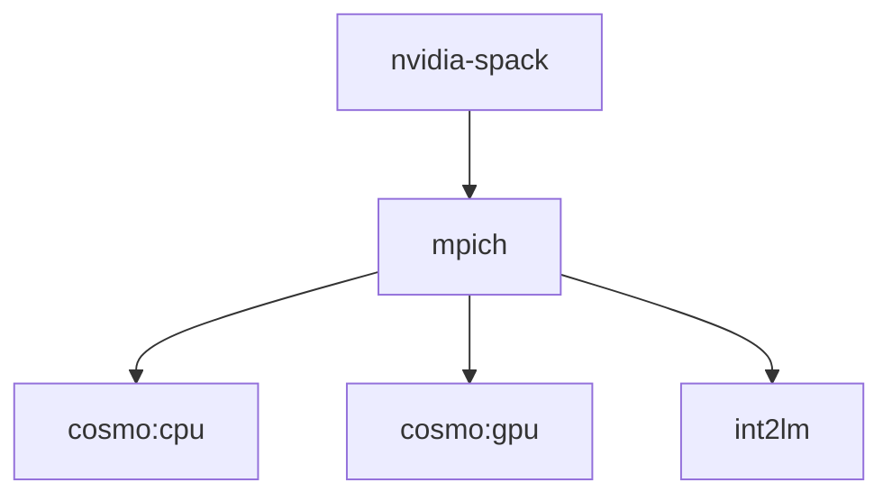

# Dockerfiles for COSMO 6.0
This set of Dockerfiles was created within the scope of a regular task submitted by several groups from the C2SM-community.
The images can be built using Docker or Buildah. To run the images at scale Sarus was used on Piz Daint at CSCS.

For more detailed information have a look at [the docs](docs).

