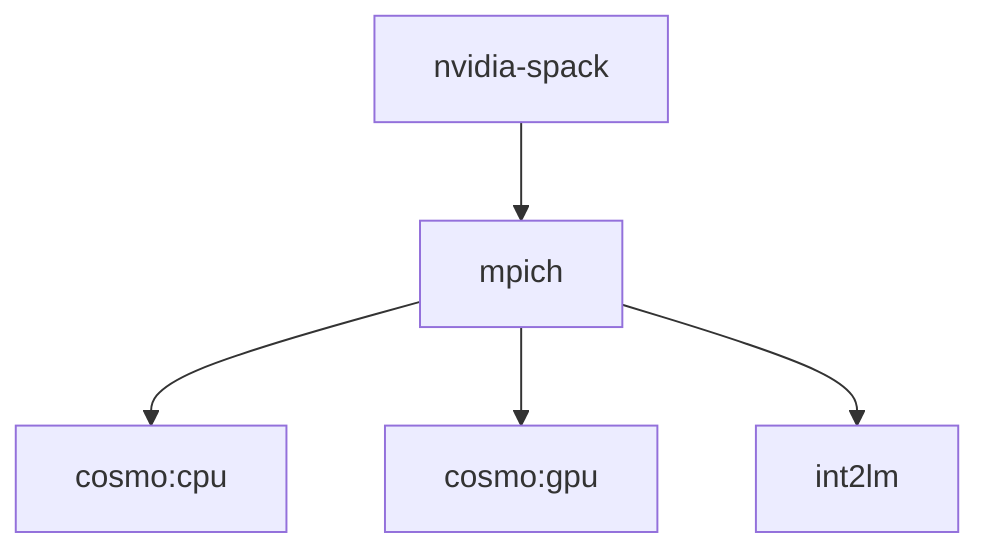

# Image structure

## General Patterns

#### Install dummy slurm
COSMO and INT2LM both have slurm as a runtime dependency. Since we onle use the binaries, but not any infrastructure from withing the container,
slurm is not used. To save build-time a dummy slurm installation is passed to spack via ```packages.yaml```:

```dockerfile
RUN echo "  slurm:" >> /root/.spack/packages.yaml && \
    echo "      buildable: false" >> /root/.spack/packages.yaml && \
    echo "      externals:" >> /root/.spack/packages.yaml && \
    echo "      - spec: slurm%gcc" >> /root/.spack/packages.yaml && \
    echo "        prefix: /usr" >> /root/.spack/packages.yaml
```
#### Load runtime environment with Spack
In order to load the correct environment variables at runtime, i.e. ```GRIB_DEFINITION_PATH```
the command ```spack load --sh``` is written to ```/etc/profile```:
```dockerfile
# dump spack-env to file
RUN echo $(spack load --sh $COSMO_SPEC) > /opt/spack-env
```
The content of ```/opt/spack-env``` is copied to the lightweight runtime image and added to ```/etc/profile```:
```dockerfile
COPY --from=builder /opt/spack-env /opt/spack-env

...

# put spack-env into profile 
RUN echo "$(cat opt/spack-env)" >> /etc/profile
```

Finally the runtime enviromnment is loaded in the entrypoint of the Dockerfile:
```dockerfile
ENTRYPOINT ["/bin/bash", "--rcfile", "/etc/profile", "-l" , "-c"]
```

## Dockerfiles



### [nvidia-spack](../nvidia-spack)
The image is taken mainly from the [official Spack Dockerfile](https://github.com/spack/spack/blob/develop/share/spack/templates/container/bootstrap-base.dockerfile).

It provides:
  * Nvidia Build Tools
  * nvhpc 21.3
  * gcc 8.4.0
  * gcc 9.3.0
  * c2sm-spack instance

Spack-c2sm and the underlying spack version are frozen.
```dockerfile
ENV SPACK_COMMIT=e24e71be6aec4e83b2d7a9023068cab377132bbe
ENV C2SM_SPACK_COMMIT=ccbe8bcdc6e84845f8d50ab627429b5b4494ceeb
```
We do so to ensure reproducability. Additionally *spack v17.0* could not compile *mpich* using nvhpc.
Therefore a more recent version containing fixes is taken.
On top of that, a couple of patches are applied to packages, namely:
  * Eccodes
  * Cosmo
  * Cosmo-Dycore
  * Int2lm
  
```dockerfile
# Eccodes: strip "%gcc" from CMake
COPY patches/ECCODES_CMake_remove_gcc.patch $ROOT/spack-c2sm/ECCODES_CMake_remove_gcc.patch
RUN cd $ROOT/spack-c2sm && git apply ECCODES_CMake_remove_gcc.patch
```
All installed compiler are added to the spack-instance using ```spack compiler find```.
At the very end of the Dockerfile a few common packages are preinstalled and added to the spack-instance
using ```spack external find```.


### [mpich](../mpich)
This Dockerfile installs mpich to reduce build-time.
To ensure subsequent installation with Spack uses the preinstalled mpich,
a variable is set:
```dockerfile
ENV MPICH_SPEC="mpich@3.4.3%nvhpc@21.3~argobots~cuda+fortran+hwloc+hydra+libxml2+pci+romio~slurm~two_level_namespace~verbs+wrapperrpath datatype-engine=auto device=ch4 netmod=ofi pmi=pmi ^findutils%gcc"
```

### [cosmo:gpu](../cosmo\:gpu)
Spack currently builds boost without any variant. Therefore we explicitely add the following variants to the spec:

```dockerfile
ENV BOOST_SPEC="boost@1.67%gcc +program_options +system"
```
The Dycore needs some specifiv variants too:

```dockerfile
ENV DYCORE_SPEC="cosmo-dycore@c2sm-master%gcc@8.4.0 cuda_arch=60 ^cuda%gcc ^$BOOST_SPEC"
```
This leads to the following Cosmo spec:
This Dockerfile install cosmo on GPU with the following spec:
```dockerfile
ENV COSMO_SPEC="cosmo@c2sm-master%nvhpc cosmo_target=gpu cuda_arch=60 ^$DYCORE_SPEC  ^$MPICH_SPEC"
```

### [cosmo:cpu](../cosmo\:cpu)
This Dockerfile install cosmo on CPU with the following spec:
```dockerfile
ENV COSMO_SPEC="cosmo@c2sm-master%nvhpc cosmo_target=cpu cuda_arch=60 ~cppdycore ^$MPICH_SPEC"
```
### [int2lm](../int2lm)
This image installs int2lm with the the following spec:
```dockerfile
ENV INT2LM_SPEC="int2lm@c2sm-master%nvhpc ^$MPICH_SPEC "
```
